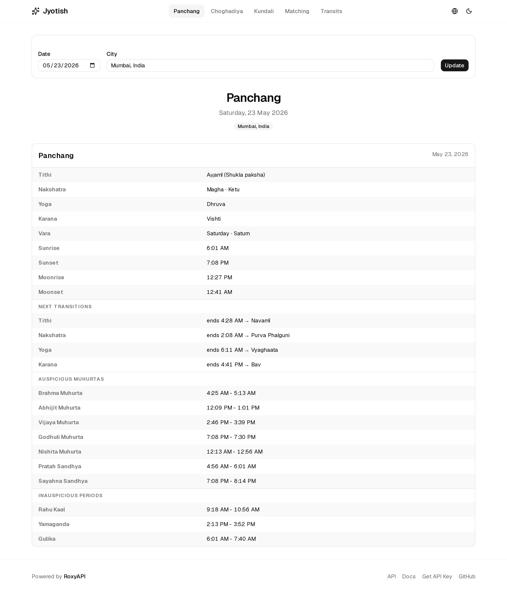
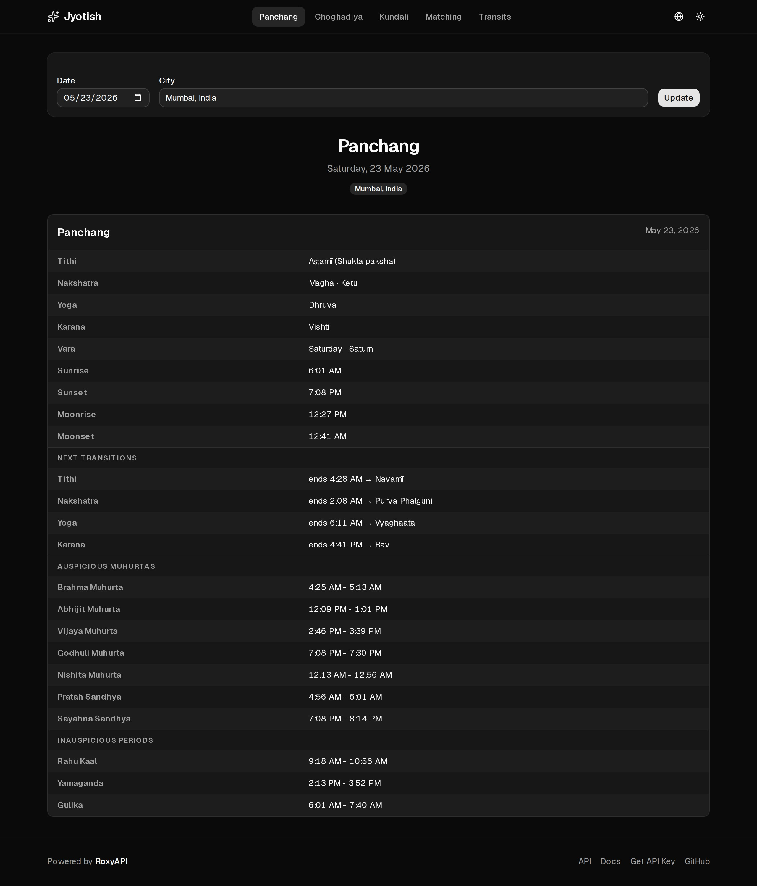
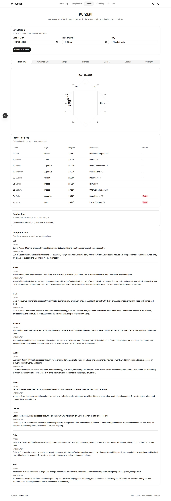
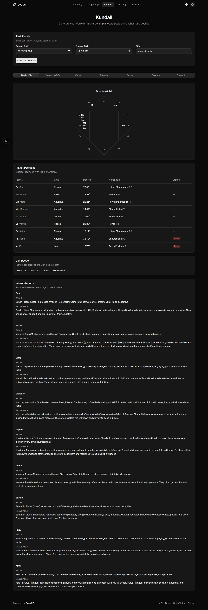

# Jyotish - Vedic Astrology Kundli Template

[](https://roxyapi.com/pricing)
[](https://vercel.com/new/clone?repository-url=https://github.com/RoxyAPI/jyotish-vedic-astrology-app&env=ROXYAPI_KEY&envDescription=Get%20your%20API%20key%20at%20roxyapi.com/pricing&project-name=jyotish&repository-name=jyotish)
[](https://roxyapi.com/api-reference#tag/vedic-astrology)
[](LICENSE)

Build a DrikPanchang-style Vedic astrology app in 30 minutes. Open-source Next.js template powered by [Roxy](https://roxyapi.com) Vedic Astrology API. Kundli generation, Panchang, Ashtakoot Gun Milan, Vimshottari Dasha, dosha analysis, and planetary transits. One API key, 40+ Jyotish endpoints.

An open-source alternative to DrikPanchang, AstroSage, and GaneshaSpeaks. Build on Roxy instead of Prokerala, Vedic Rishi, or OnlineJyotish APIs. Full control over your UI, data, and user experience.

### Panchang

| Light | Dark |
|-------|------|
|  |  |

### Kundali

| Light | Dark |
|-------|------|
|  |  |

## What you get

- **Janam Kundli generator** - D1 Rashi chart and D9 Navamsa chart with North Indian diamond SVG visualization, all 9 Navagraha positions, 27 nakshatras with pada, retrograde and combustion detection
- **Ashtakoot Gun Milan** - 36-point compatibility scoring with 8 Koota breakdown (Varna, Vashya, Tara, Yoni, Graha Maitri, Gana, Bhakoot, Nadi) and Dosha warnings for kundli matching and matrimonial apps
- **Vimshottari Dasha** - Complete 120-year Mahadasha-Antardasha timeline from birth Moon nakshatra, current running period highlighted
- **Dosha detection** - Manglik Dosha (Mars placement analysis), Kalsarpa Dosha (12 types), and Shani Sade Sati (7.5-year Saturn transit) with severity, cancellation factors, and remedies
- **Daily Panchang** - Tithi, Nakshatra, Yoga, Karana, Vara with auspicious muhurta (Brahma, Abhijit, Vijaya, Godhuli, Amrit Kalam) and inauspicious periods (Rahu Kaal, Yamaganda, Gulika Kaal, Dur Muhurta, Varjyam)
- **Monthly transits** - Planetary sign ingress events with retrograde (Vakri/Margi) tracking
- **City autocomplete** - 7,000+ cities worldwide with coordinates and timezone from the Location API
- **Dark mode** - System-aware light and dark themes using next-themes with zero flash
- **Type-safe** - Full TypeScript types auto-generated from the OpenAPI specification. Every API response fully typed, zero guesswork.

## Stack

| Technology | Purpose |
|-----------|---------|
| [Next.js 16](https://nextjs.org) | App Router, Server Actions, Turbopack |
| [shadcn/ui](https://ui.shadcn.com) | Component library with Tailwind CSS v4 theming |
| [next-themes](https://github.com/pacocoursey/next-themes) | Dark mode with zero white flash |
| [openapi-fetch](https://openapi-ts.dev) + [openapi-typescript](https://openapi-ts.dev) | Type-safe API client from OpenAPI spec |
| [Roxy Vedic Astrology API](https://roxyapi.com/products/vedic-astrology-api) | 40+ Jyotish endpoints, verified calculations |
| [Roxy Location API](https://roxyapi.com/products/location-api) | City autocomplete with coordinates and timezone |

## Quick start

### 1. Clone and install

```bash
git clone https://github.com/RoxyAPI/jyotish-vedic-astrology-app.git
cd jyotish-vedic-astrology-app
npm install
```

### 2. Get your API key

Get instant API key access at **[roxyapi.com/pricing](https://roxyapi.com/pricing)**. One key unlocks all Vedic astrology and location endpoints.

Add it to `.env.local`:

```
ROXYAPI_KEY=your-api-key-here
```

> Your key stays server-side only. Never exposed to the browser. If the key is missing, the app shows a branded setup page with instructions.

### 3. Start building

```bash
npm run dev
```

Open [http://localhost:3000](http://localhost:3000). Your kundli app is live.

## API endpoints used

Types auto-generated from the [OpenAPI spec](https://roxyapi.com/api/v2/vedic-astrology/openapi.json) (public, no auth needed for type generation).

| Feature | Endpoint | What it returns |
|---------|----------|----------------|
| Panchang | `POST /panchang/detailed` | Tithi, Nakshatra, Yoga, Karana, muhurta windows |
| Kundli (D1) | `POST /birth-chart` | Rashi chart with 9 planets, nakshatras, pada |
| Navamsa (D9) | `POST /navamsa` | D9 chart with Vargottama detection |
| Dasha | `POST /dasha/major` | 120-year Vimshottari Mahadasha timeline |
| Manglik | `POST /dosha/manglik` | Mars dosha severity, cancellations, remedies |
| Kalsarpa | `POST /dosha/kalsarpa` | 12 Kalsarpa types, Rahu-Ketu axis analysis |
| Sade Sati | `POST /dosha/sadhesati` | Saturn transit phase (Rising/Peak/Setting) |
| Gun Milan | `POST /compatibility` | 36-point Ashtakoot score, 8 Koota breakdown |
| Transits | `POST /transit/monthly` | Sign ingress events, retrograde dates |
| City Search | `GET /search` | 7,000+ cities with lat/lng/timezone |

This template uses 10 of the 40+ available endpoints. See the full [API reference](https://roxyapi.com/api-reference#tag/vedic-astrology) for divisional charts (D2-D60), Ashtakavarga, Shadbala, KP astrology, Choghadiya, Hora, aspects, parallels, ecliptic crossings, and monthly ephemeris.

## Project structure

```
src/
├── api/
│   ├── client.ts          # Vedic Astrology API client (server-side)
│   ├── location-client.ts  # Location API client (server-side)
│   ├── check-key.ts       # API key guard
│   ├── schema.ts          # Auto-generated Vedic Astrology types
│   └── location-schema.ts # Auto-generated Location types
├── app/
│   ├── page.tsx           # Home: daily Panchang
│   ├── kundali/           # Birth chart with tabbed results
│   ├── matching/          # Ashtakoot Gun Milan compatibility
│   ├── transits/          # Monthly planetary transit calendar
│   └── api/cities/        # Server-side proxy for city search
├── components/
│   ├── birth-chart.tsx    # North Indian diamond chart (SVG)
│   ├── city-search.tsx    # Debounced city autocomplete
│   ├── api-key-missing.tsx # Setup guide when key is missing
│   ├── api-error.tsx      # Branded error state
│   ├── navbar.tsx         # Navigation with dark mode toggle
│   ├── footer.tsx         # Powered by RoxyAPI
│   └── ui/               # shadcn/ui components
└── lib/
    └── constants.ts       # Planet abbreviations, rashi names
```

## Regenerate types

When the API adds new endpoints or fields:

```bash
npm run generate:types
```

This regenerates both Vedic Astrology and Location API types.

## Customize

**Colors** - Edit CSS variables in `src/app/globals.css`. All components use shadcn semantic tokens (`primary`, `secondary`, `muted`, `accent`, `destructive`). Switch themes instantly by changing the CSS variables.

**Chart visualization** - `BirthChart` component renders North Indian diamond style as SVG. Modify the geometry for South Indian or Western wheel charts.

**Add more features** - The API has 40+ endpoints not used in this template. Add Choghadiya, Hora, divisional charts (D2-D60), Ashtakavarga, Shadbala, KP astrology, and more.

## Deploy

One-click deploy on [Vercel](https://vercel.com). Set `ROXYAPI_KEY` in environment variables.

## Why Roxy over other Vedic astrology APIs

- **Breadth** - 40+ Vedic astrology endpoints plus Western astrology, tarot, numerology, dreams, crystals, I-Ching, and angel numbers under one API key
- **Type-safe** - Full OpenAPI spec with auto-generated TypeScript types. No guessing response shapes.
- **City search** - Built-in location API with 7,000+ cities, coordinates, and DST-aware timezone offsets
- **KP astrology** - Full Krishnamurti Paddhati system (Placidus cusps, 249 sub-lords, significators) alongside Parashari
- **API-first** - Every feature is a REST endpoint. Build web, mobile, desktop, chatbot, or AI agent interfaces.
- **MCP ready** - Connect AI agents to all endpoints via MCP server

## Built by Roxy

This template is built and maintained by [RoxyAPI](https://roxyapi.com). Roxy is production-ready infrastructure for astrology, tarot, numerology, and spiritual intelligence apps.

- [Vedic Astrology API](https://roxyapi.com/products/vedic-astrology-api)
- [Browse all APIs](https://roxyapi.com/products)
- [API reference and playground](https://roxyapi.com/api-reference#tag/vedic-astrology)
- [Get API key](https://roxyapi.com/pricing)
- [All templates](https://roxyapi.com/starters)
- [Connect AI agents via MCP](https://roxyapi.com/docs/mcp)

## License

MIT
